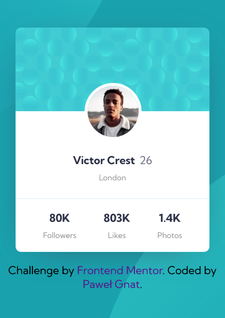

# Frontend Mentor - Profile card component solution

This is a solution to the [Profile card component challenge on Frontend Mentor](https://www.frontendmentor.io/challenges/profile-card-component-cfArpWshJ). Frontend Mentor challenges help you improve your coding skills by building realistic projects.

## Table of contents

- [Overview](#overview)
  - [Screenshot](#screenshot)
  - [Links](#links)
- [My process](#my-process)
  - [Built with](#built-with)
  - [What I learned](#what-i-learned)
- [Author](#author)

## Overview

### Screenshot

### Links

- Live Site URL: [Profile Card Component](xx)

## My process

Simple task. Created divs with appropriate positioning.

### Built with

- Semantic HTML5 markup
- CSS custom properties
- Flexbox
- Mobile-first workflow

### What I learned

I managed to complete this challenge in 2 hours. I learned how to display 2 images in background and how to position them.

## Author

- Frontend Mentor - [@Pawel-Gnat](https://www.frontendmentor.io/profile/Pawel-Gnat)
